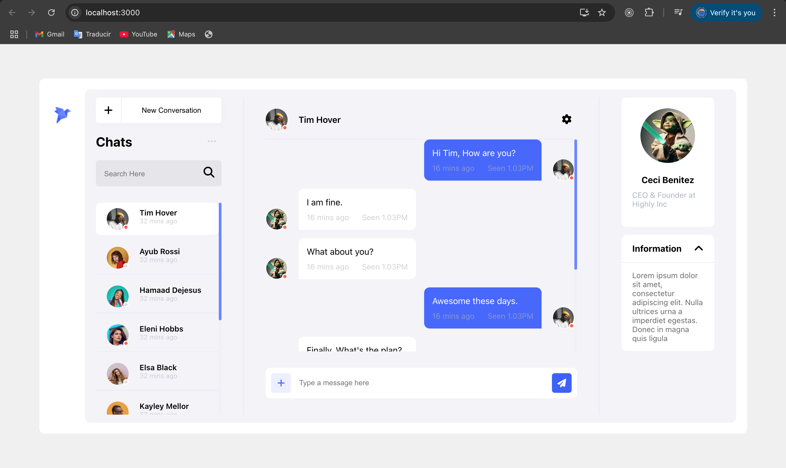

# Chat UI
A basic vanilla css app with basic styling for the UI of a chat application.
(desktop only)

### Built with
- HTML
- CSS
- Animations and hover effects

### Getting Started with Create React App

This project was bootstrapped with [Create React App](https://github.com/facebook/create-react-app).

### Available Scripts

First of all clone this repository.

In the project directory, you can run:

- step 1: run `npm install` (wait untill all node-modules are in place) 

- step 2: run `npm start` (open the project in the browser)

## License

